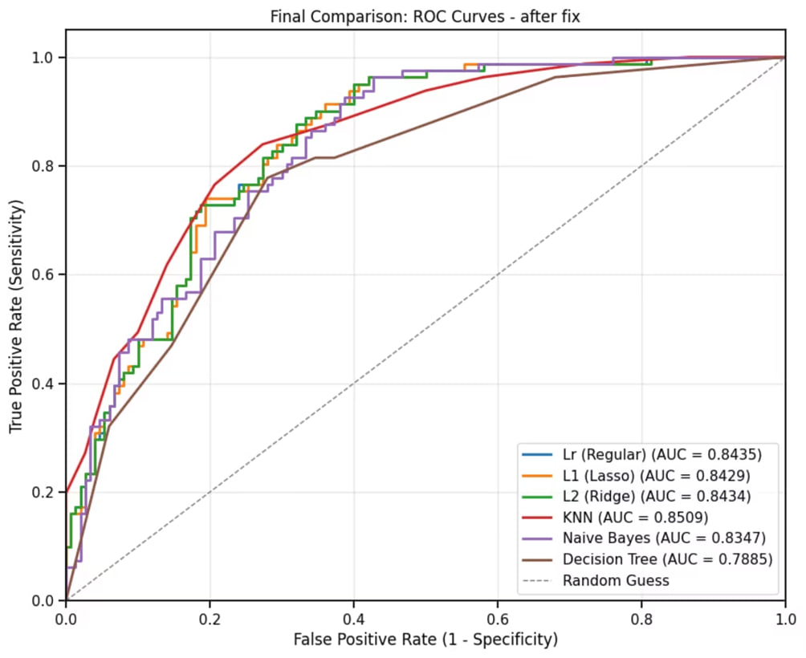
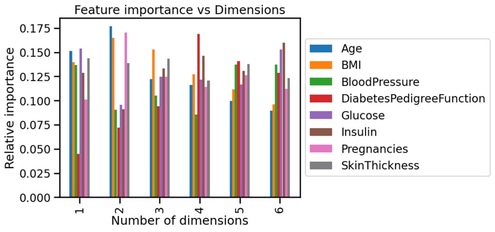
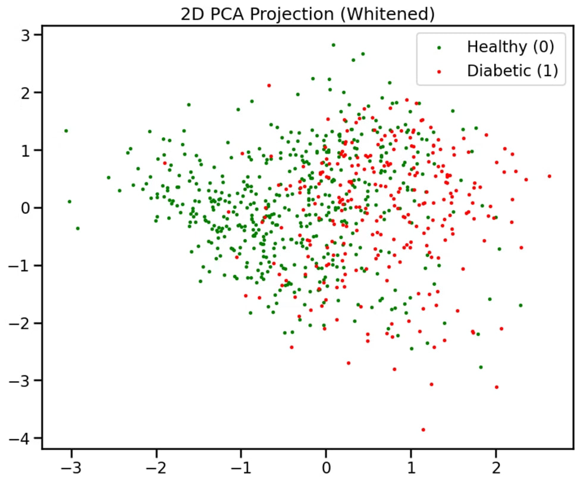

# Diabetes Diagnosis — Machine Learning Project

A comprehensive machine learning project for predicting diabetes using the **Pima Indians Diabetes Database**. This project was developed as a final project by **Yaniv Moradov, Amit Moradov, and Yinon Shaul**.

---

## 📋 Table of Contents

- [Project Overview](#-project-overview)
- [Dataset](#-dataset)
- [Project Structure](#-project-structure)
- [Methodology](#-methodology)
- [Models & Results](#-models--results)
- [Technologies Used](#-technologies-used)
- [Getting Started](#-getting-started)

---

## 🔍 Project Overview

The objective is to diagnostically predict whether a patient has diabetes based on clinical measurements. The project covers the full machine learning pipeline:

1. **Exploratory Data Analysis (EDA)**
2. **Data Preprocessing & Feature Engineering**
3. **Supervised Learning** — classification with multiple algorithms
4. **Unsupervised Learning** — PCA and K-Means clustering
5. **Model Evaluation & Comparison**

---

## 📊 Dataset

**Pima Indians Diabetes Database** — a widely used benchmark dataset for binary classification in medical diagnosis.

| Feature | Description |
|---|---|
| `Pregnancies` | Number of times pregnant |
| `Glucose` | Plasma glucose concentration (2-hour oral glucose tolerance test) |
| `BloodPressure` | Diastolic blood pressure (mm Hg) |
| `SkinThickness` | Triceps skin fold thickness (mm) |
| `Insulin` | 2-hour serum insulin (mu U/ml) |
| `BMI` | Body mass index (kg/m²) |
| `DiabetesPedigreeFunction` | Family history-based diabetes risk score |
| `Age` | Age (years) |
| `Outcome` | Target variable — `0` = No Diabetes, `1` = Diabetes |

- **768 samples**, **8 features**, **binary target**
- **Class distribution**: ~65% negative (0), ~35% positive (1)

---

## 📁 Project Structure

```
Diabetes-Project/
├── Final_Project_Diabetes (1).ipynb   # Interactive Jupyter/Colab notebook
├── final_project_diabetes.py          # Full Python source (exported from notebook)
├── Diabetes-Diagnosis-Project.pptx   # Project presentation slides
└── Photos/                            # Visualizations and result screenshots
    ├── Supervise_Comparing.jpg
    ├── PCA_Visualization.jpg
    └── PCA_Feature_Importance.jpg
```

---

## 🔬 Methodology

### 1. Exploratory Data Analysis
- Distribution and shape inspection
- Correlation matrix analysis
- Pairplot visualizations colored by diagnosis outcome

### 2. Data Preprocessing
- **Log transformation** for skewed features (skewness > 0.75)
- **Standard scaling** (zero mean, unit variance)
- **Stratified train/test split** — 70% training / 30% testing (preserving class balance)

### 3. Data Quality Fixing
Several features contained biologically impossible zero values (e.g., zero blood pressure or zero BMI). These were detected, replaced with `NaN`, and imputed using the column median.

**Affected columns:** `Glucose`, `BloodPressure`, `SkinThickness`, `Insulin`, `BMI`

> Note: `Pregnancies` was excluded from this fix since 0 is a valid value.

---

## 🤖 Models & Results

### Supervised Learning

#### K-Nearest Neighbors (KNN)
- Grid search over `k ∈ [1, 20]` using 5-fold cross-validation
- Distance metric: Euclidean; weights: uniform
- Best `k` selected by cross-validated accuracy

#### Logistic Regression
Three variants trained and compared:
| Model | Regularization |
|---|---|
| Logistic Regression (Regular) | L2, C=1.0 (default) |
| L1 (Lasso) | L1 with CV-tuned C |
| L2 (Ridge) | L2 with CV-tuned C |

- Coefficient comparison across all three variants
- Custom classification threshold (0.35) applied to improve recall for the positive (diabetic) class

#### Gaussian Naive Bayes
- Selected for continuous numerical features
- 4-fold cross-validation on training set

#### Decision Tree
Three variants evaluated:
| Variant | Description |
|---|---|
| Full Tree | No depth limit — maximum complexity |
| Shallow Tree | `max_depth=3` — constrained, more generalizable |
| Optimized Tree | Best depth/leaf/criterion via GridSearchCV |

### Evaluation Metrics

All models are evaluated using:
- **Accuracy**, **Precision**, **Recall**, **F1-Score**
- **ROC-AUC** score
- **Confusion matrices**
- **Train vs. Test accuracy gap** (overfitting analysis)

A unified **ROC curve comparison** is plotted across all models for direct performance benchmarking.



### Unsupervised Learning

#### Principal Component Analysis (PCA)
- PCA applied with `n_components ∈ [1, 6]`
- Explained variance and feature importance analyzed per number of components
- 2D whitened PCA projection for visual cluster separation





#### K-Means Clustering (via Pipeline)
- `PCA → KMeans (k=2)` pipeline tested across 1–7 dimensions
- 5-fold stratified cross-validation used to estimate clustering accuracy per dimensionality

---

## 🛠️ Technologies Used

| Library | Purpose |
|---|---|
| `pandas` | Data loading and manipulation |
| `numpy` | Numerical operations |
| `scikit-learn` | ML models, preprocessing, evaluation |
| `matplotlib` | Plotting and visualizations |
| `seaborn` | Statistical visualizations |
| Google Colab | Development environment |

---

## 🚀 Getting Started

### Prerequisites

```bash
pip install pandas numpy scikit-learn matplotlib seaborn
```

### Running the Notebook

1. Open `Final_Project_Diabetes (1).ipynb` in [Google Colab](https://colab.research.google.com/) or Jupyter.
2. Upload your `diabetes.csv` dataset to Google Drive (or update the `filepath` variable).
3. Run all cells sequentially.

Alternatively, run the exported Python script:

```bash
python final_project_diabetes.py
```

> **Note:** The script was originally designed for Google Colab. If running locally, remove or replace the `drive.mount(...)` call and update the `filepath` to point to your local `diabetes.csv`.

---

## 👥 Team

| Name |
|---|
| Yaniv Moradov |
| Amit Moradov |
| Yinon Shaul |
